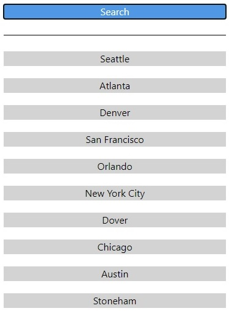
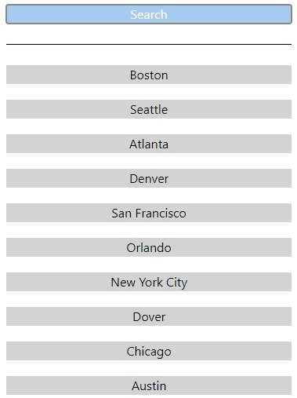
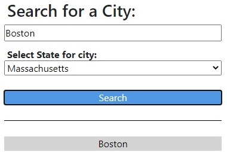
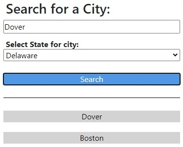

# Weather_Dashboard
This repository was created for the Homework Assignment dealing with Server Side API's.

Developer: Duane Cantera 
Date: Oct. 23, 2021 
Assignment: 06 Server Side API's

****************
PAGE LAYOUT:
****************

The layout of the web page has been broken up in to two sections.  The Search section is on the left side of the page and the Weather Forecast section is on the right.  I created the main section as a relative parent so the Search section can be position there and it will not move when the Weather Forecast section next to it changes its size.

< head > - Header Section: Contains the Title: Weather Dashboard

< main > 
 &nbsp;&nbsp;&nbsp;&nbsp;< section > - Search Space 
 &nbsp;&nbsp;&nbsp;&nbsp;< section > - Search Block

    < section > - Right Panel
        < section > - Location Block
        < section > - Forecast Block
            < div > - Forecast Day 1
            < div > - Forecast Day 2
            < div > - Forecast Day 3
            < div > - Forecast Day 4
            < div > - Forecast Day 5

********************
WEB PAGE DESIGN:
********************

The Search section of the web page is in the HTML file and the elements in this section are only displayed when the page is first displayed.  When a user enters a City the elements that make up the right panel are created and appended to the main section dynamically.

*********************
APPLICATIONS USED:
*********************

Bootstrap: I am using the bootstrap 4.3.1 css style sheet.
moment: I am using moment.js version 2.24.0/moment.min.js

*************************
DESIGN ISSUES:
*************************

Project Code: 
This project was created using JavaScript.

Maximum Cities Enter: 
I set the maximum value for the number of cities entered to 10.  You can see below 10 cities have been added.

You can see below when a new city is added, it is added to the top and the bottom one is removed.

How Buttons Are Added:
Buttons are added from the top.  

After the first one is added the additional buttons added will be added before the first one.

*********************
API's USED:
*********************

Open Weather: Geocoding API - I used this API, passing in the City Name, State Code and Country Code to get the Longitude and Latitude values.

Open Weather: Daily Forcast 7 Days API - I used this API, passing in the Longitude and Latitude that I got from the previous API to get the
              seven day forecast.

*********************
DEVELOPMENT ISSUES:
*********************

Issue: Inline blocks next to one another inside a container - One would move when the size of other one changes:

Solution: I found that I had to create a relative parent container and then I could position the child absolute and the child element
would be positioned where the parent container is located and would not move when the inline block next to it changes size.

Issue: I need the state code value in order to get the Longitude and Latitude values for the Open Weather Geocoding API.
Solution: I added a drop-down control to the search section under the city text input control.  It contains the names of all of the states
and for each state it contains the state code value.

***************************
RESPONSIVE DESIGN ISSUES:
***************************

I performed the following operations as the size of the screen got smaller:
I used Flexbox technology and change the flex direction from row to column for the forecast day elements.
I also change the width percentage values for the left and right sections of the page.
I also changed the font size for some of the text.

***************
LINKS:
***************

Link To Deployed Application: https://canterad.github.io/Weather_Dashboard/
